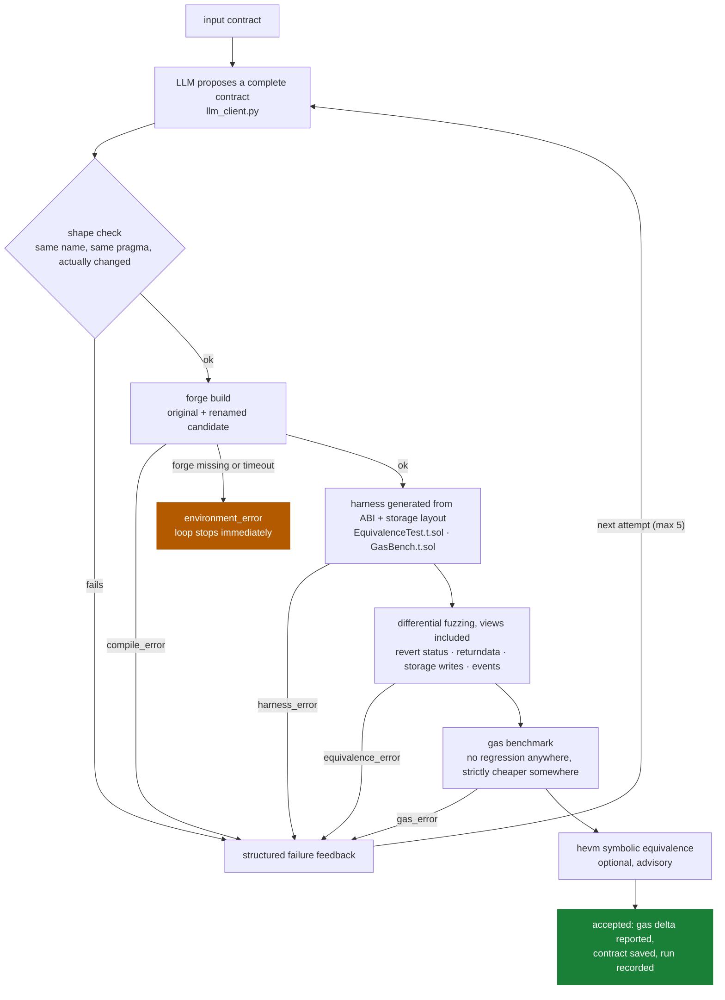
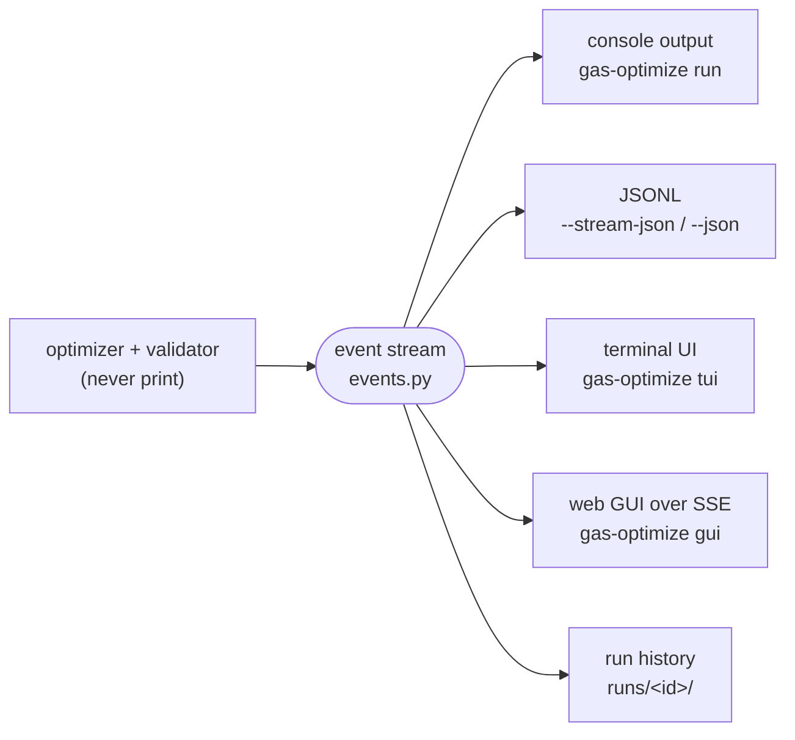

# AI-Powered Solidity Gas Optimizer

[](https://github.com/St1viG/gas-optimiser/actions/workflows/ci.yml)
[](LICENSE)
[](pyproject.toml)

Optimizes Solidity contracts for runtime gas using an LLM, wrapped in a
generate-and-verify loop. A proposal is accepted only if it is **provably
equivalent** to the original under differential fuzzing **and measurably
cheaper**.

Both halves matter. Equivalence alone accepts a candidate that changed nothing.

## How it works

The model proposes a complete rewritten contract; the validator tries to break
it. Any failure becomes structured feedback for the next attempt, except an
environment problem, which stops the loop instead of burning retries on
something the model cannot fix.



The equivalence check is a **low-level call** to each contract with identical
calldata from identical seeded state. That is what lets a reverting original
count as a pass (when the candidate reverts identically) and what makes return
values and revert reasons comparable as raw bytes. View functions are verified
too — both fuzzed directly and re-checked after every mutating call, so a
getter that lies about mutated state is caught. See
[docs/validator.md](docs/validator.md) for the details.

Every stage reports through one typed event stream, and each interface is just
a different renderer over it:



## Quick start

Requires **Python 3.10+**, [Foundry](https://getfoundry.sh) (`forge`), and
optionally [hevm](https://github.com/ethereum/hevm) (install instructions in
[docs/validator.md](docs/validator.md#installing-hevm)). Run from a git clone —
the `foundry/` workspace ships with the repo.

```bash
git clone https://github.com/St1viG/gas-optimiser && cd gas-optimiser
python -m venv .venv && source .venv/bin/activate
pip install -e ".[dev]"        # add the frontends too: pip install -e ".[dev,ui]"

cp .env.example .env           # then add your Hugging Face token
gas-optimize doctor            # verify forge, token and the workspace
gas-optimize run test-cases/tc2.txt
```

`.env` is gitignored. The token is read from the environment at call time.

## Usage

### Optimize a contract

```bash
gas-optimize run test-cases/tc2.txt
gas-optimize run test-cases/tc4.txt -o optimized/Vault.sol
gas-optimize run test-cases/tc2.txt --fuzz-runs 500 --max-retries 3 --hevm
gas-optimize run test-cases/tc2.txt --json          # one final JSON object
gas-optimize run test-cases/tc2.txt --stream-json   # JSONL event stream
```

An accepted contract is written to `<input dir>/<Contract>.optimized.sol` by
default (`-o` overrides, `--no-output` suppresses), and every run is recorded
under `runs/<id>/` with its event log, sources and diff (`--no-save-run`
skips). The bare pre-0.2 form `gas-optimize <file>` still works.

Exit codes: `0` accepted · `1` rejected/failed · `2` environment or usage error.

### Compare two contracts directly — no model involved

```bash
gas-optimize validate tests/fixtures/ERC20.sol tests/fixtures/ERC20Candidate.sol
```

```
[VALIDATE] ERC20 (ERC20.sol) vs ERC20Candidate (ERC20Candidate.sol)
[VALIDATE] Building...
[VALIDATE] Generating equivalence + gas harness...
[VALIDATE] Covering 3 function(s): transfer(address,uint256), totalSupply(), balanceOf(address)
[VALIDATE] Differential fuzzing (2000 runs)...
[VALIDATE] Equivalence holds.
[VALIDATE] Measuring gas...

ACCEPTED: equivalent and cheaper
  balanceOf(address): 23721 -> 23721 gas (0)
  totalSupply(): 23324 -> 23324 gas (0)
  transfer(address,uint256): 32230 -> 32145 gas (-85)
  total: -85 gas
```

### TUI and web GUI

```bash
pip install -e ".[ui]"
gas-optimize tui test-cases/tc2.txt    # terminal UI: live gates, gas table, diff
gas-optimize gui                       # local web UI at http://127.0.0.1:8765
```

The GUI is a chat-style page: paste or drop a contract, watch each attempt's
gate checklist fill in live, and browse past runs in the sidebar. Rejection
cards show the exact feedback the model receives. One run at a time — the
Foundry workspace is shared. Local only, no authentication; see
[docs/frontends.md](docs/frontends.md) for the API and event schema.

## Configuration

Settings resolve in order: **CLI flag > environment > `gas-optimizer.toml` >
defaults**.

```bash
gas-optimize config init                    # create gas-optimizer.toml from the template
gas-optimize config show                    # effective settings + where they came from
gas-optimize config set hevm.enabled true   # persist one setting
```

The file is gitignored, so tuning never dirties the tree.

| Setting | Meaning | Default |
| --- | --- | --- |
| `validator.fuzz_runs` | Fuzz iterations per generated test | `2000` |
| `validator.require_gas_improvement` | Reject a candidate that is not strictly cheaper | `true` |
| `validator.forge_timeout` | Per-command timeout for `forge`, in seconds | `900` |
| `validator.max_array_length` | Cap applied to fuzzed dynamic arrays | `5` |
| `hevm.enabled` | Run the symbolic equivalence proof | `false` |
| `hevm.timeout` | Overall hevm timeout (seconds) | `300` |
| `hevm.solver` | SMT solver (`z3`, `bitwuzla`, `cvc5`) | `z3` |
| `hevm.smt_timeout` | Per-query SMT timeout, in **seconds** | `30` |
| `hevm.max_iterations` | Loop-unroll bound for hevm | `5` |
| `llm.model` | Hugging Face model id | `Qwen/Qwen2.5-Coder-32B-Instruct` |
| `llm.max_retries` | Attempts at the optimize-and-verify loop | `5` |
| `llm.api_retries` | Attempts at a single API call | `3` |
| `gui.host` / `gui.port` | Web GUI bind address | `127.0.0.1:8765` |

Each setting also has a `GAS_OPTIMIZER_*` environment variable (e.g.
`GAS_OPTIMIZER_FUZZ_RUNS`); the pre-0.2 names `MODEL_ID`, `MAX_RETRIES` and
`API_RETRIES` still work. `HF_TOKEN` and `HF_PROVIDER` stay environment-only
(`.env` is loaded automatically). A legacy `validatorConfig.txt` is still read
with a deprecation warning — convert it with `gas-optimize config migrate`.

## Layout

```
├── run.py                  entry point (thin shim over gas_optimizer.cli)
├── pyproject.toml          package metadata, deps, ruff/mypy/pytest config
├── gas-optimizer.example.toml   config template (copy: gas-optimize config init)
├── Makefile                install / lint / typecheck / test / controls
├── scripts/controls.sh     fixture pairs with known verdicts, via the real CLI
├── gas_optimizer/
│   ├── cli.py              subcommands: run/validate/config/doctor/tui/gui
│   ├── config.py           paths + environment
│   ├── settings.py         layered TOML config (flag > env > file > defaults)
│   ├── events.py           the structured progress-event stream
│   ├── render.py           console + JSONL renderers over the events
│   ├── preflight.py        forge/hevm/token/workspace checks (doctor)
│   ├── runstore.py         run history under runs/
│   ├── llm_client.py       Hugging Face Inference, with retry/backoff
│   ├── prompts.py          system/user prompts
│   ├── optimizer.py        the generate-and-verify loop
│   ├── utils.py            response cleaning + pre-compile shape checks
│   ├── validator.py        the gates
│   ├── frontends/
│   │   ├── tui.py          Textual terminal UI          (extra: [tui])
│   │   └── web/            FastAPI + SSE + one-page GUI (extra: [gui])
│   └── verification/
│       ├── artifacts.py            ABI + storage layout from build output
│       ├── solidity_types.py       ABI type helpers
│       └── harness_generator.py    emits the equivalence + gas harness
├── foundry/                Foundry workspace (forge runs here)
│   ├── src/, test/         scratch — cleared and regenerated every run
│   └── lib/forge-std       vendored
├── runs/                   recorded runs (gitignored)
├── test-cases/             input contracts
├── tests/                  pytest suite + fixture contract pairs
└── docs/                   validator internals + frontends/API
```

## Tests

```bash
make test        # unit only, no forge required (fast)
make test-all    # full suite
make controls    # fixture pairs through the real CLI
make lint typecheck
```

No API token is needed: the suite drives the loop with a scripted model. The
fixture pairs in `tests/fixtures/` are controls with known verdicts — each
rejection corresponds to a soundness hole the harness used to have, each
acceptance pins a capability:

| Pair | Verdict | What it pins down |
| --- | --- | --- |
| `ERC20` / `ERC20Candidate` | accepted¹ | Guarded `unchecked` add is equivalent and cheaper |
| `Vault` / `VaultCandidate` | accepted | `unchecked` after `require` is sound |
| `Registry` / `RegistryViewOpt` | accepted | A saving confined to a view satisfies the gas gate |
| `ERC4626` / `ERC4626Candidate` | rejected | `unchecked` subtraction wraps where the original reverts |
| `Vault` / `VaultBadReturn` | rejected | Identical storage, wrong return value |
| `Emitter` / `EmitterCandidate` | rejected | Identical storage and return, dropped event |
| `Counter` / `CounterBadView` | rejected | Identical storage and mutations, lying getter |
| `ERC20` / renamed copy | rejected | Equivalent but no gas saved |

¹ Under the fuzz and gas gates. hevm rejects it — see
[hevm is much stricter than the fuzzer](docs/validator.md#hevm-is-much-stricter-than-the-fuzzer).

## Notes

- `foundry/src/` and `foundry/test/` are **scratch**: cleared and regenerated on
  every run. Nothing there is source. Accepted output survives in `runs/` and
  next to the input.
- The candidate is renamed to `<Name>Candidate` on write. Without that both
  files declare the same contract, the candidate overwrites the original, and
  the harness compares a contract to itself.
- Licensed under GPL-3.0 (see `LICENSE`). Changes are tracked in
  [CHANGELOG.md](CHANGELOG.md).
